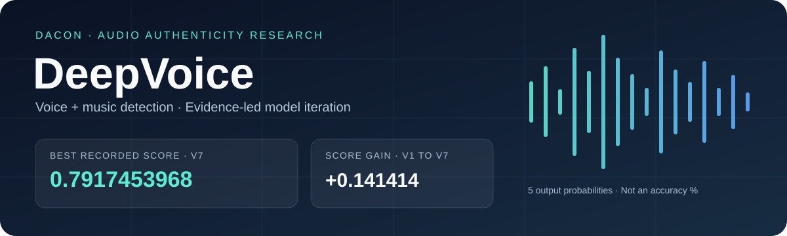
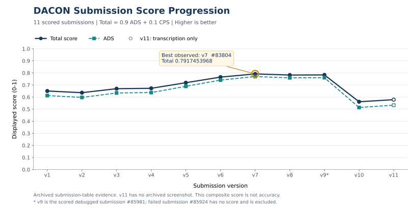
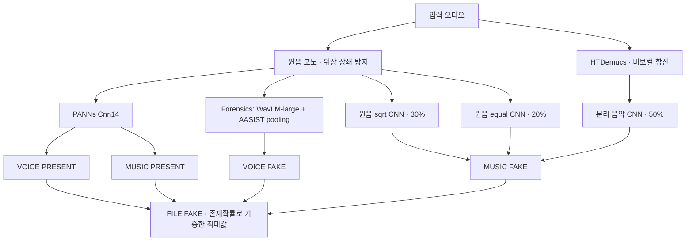

<p align="center">
  
</p>

<p align="center">
  <a href="https://www.dacon.io/competitions/official/236749/overview/description">DACON 대회</a> ·
  <a href="#dacon-제출-결과">제출 결과</a> ·
  <a href="#v7-모델-구조">모델 구조</a> ·
  <a href="#가중치-정보">가중치</a> ·
  <a href="#학습-데이터셋">데이터셋</a> ·
  <a href="#학습-컴퓨터-사양">학습 환경</a> ·
  <a href="#내부-실험--채택과-기각">내부 실험</a> ·
  <a href="#공개-코드와-테스트">코드 &amp; 테스트</a>
</p>

# DeepVoice · 음성과 음악의 AI 위조 탐지

**딥보이스 범죄 대응을 위한 AI 탐지 모델 경진대회**에서 수행한 모델 개선과 검증 기록입니다. 파일 전체의 위조 여부뿐 아니라 **음성·음악의 존재와 진위**, 총 5개의 확률을 예측합니다.

이 저장소는 **결과 아카이브와 연구 코드 일부**입니다. 데이터셋·제출 ZIP은 포함하지 않습니다. 재배포 조건을 확인한 **PANNs 가중치 1개만 별도 Releases에 공개**하며, 나머지 가중치는 보류합니다. 공개 코드와 이 파일만으로 전체 v7 추론을 재현할 수는 없습니다.

| 가장 높은 기록 | 최초 개선본 대비 | 존재 탐지 CPS | 표시 소요 시간 |
|:---:|:---:|:---:|:---:|
| **v7 · 0.7917453968** | **+0.1414142857** | **0.9893111111** | **17분 14초** |

> 2026-10-01 자료 정리 기준. 위 점수는 보관된 **DACON 제출 화면**과 결과 기록에서 확인한 값이며, 정확도 79.17%라는 뜻이 아닙니다. 최종 순위·수상·규정 적합성을 증명하는 기록도 아닙니다.

## DACON 제출 결과



**v1 → v7**에서 총점은 `0.6503311111 → 0.7917453968`, 진위 탐지 ADS는 `0.6126666667 → 0.7697936508`로 높아졌습니다. CPS는 동일했습니다. v8 이후 채점된 후보는 v7을 넘지 못했습니다.

| 버전 | 제출 ID | 총점 ↑ | ADS ↑ | CPS ↑ | 소요 시간¹ |
|:---|---:|---:|---:|---:|---:|
| v1 | 78917 | 0.6503311111 | 0.6126666667 | 0.9893111111 | 19:54 |
| v2 | 79465 | 0.6365096825 | 0.5973095238 | 0.9893111111 | 20:08 |
| v3 | 82491 | 0.6696168254 | 0.6340952381 | 0.9893111111 | 19:50 |
| v4 | 82793 | 0.6727025397 | 0.6375238095 | 0.9893111111 | 20:22 |
| v5 | 82822 | 0.7191168254 | 0.6890952381 | 0.9893111111 | 17:58 |
| v6 | 83485 | 0.7655168254 | 0.7406507937 | 0.9893111111 | 17:11 |
| **v7 · 최고 기록** | **83804** | **0.7917453968** | **0.7697936508** | **0.9893111111** | **17:14** |
| v8 | 84048 | 0.7824882540 | 0.7595079365 | 0.9893111111 | 17:19 |
| v9_debugged | 85981 | 0.7835168254 | 0.7606507937 | 0.9893111111 | 34:41 |
| v10 | 86849 | 0.5614983386 | 0.5140476190 | 0.9885548148 | 1:10 |
| v11² | 86972 | 0.5787269101 | 0.5331904762 | 0.9885548148 | 1:40 |

¹ DACON 화면의 표시 시간이며 통제된 동일 장비 벤치마크가 아닙니다. v1은 공식 원본 베이스라인이 아니라 이 프로젝트의 최초 개선 제출본입니다. 원본 베이스라인 대비 공식 점수 개선은 이 표로 증명하지 않습니다.

² v1–v10은 보관 스크린샷과 대조했습니다. v11은 사용자 제공 결과의 전사 기록만 있으며 전용 원본 스크린샷은 없습니다. 최초 v9 `#85924`는 제출 오류로 점수가 없습니다.

원시 수치: [JSON](results/official_scores.json) · [CSV](results/official_scores.csv) · [검증 근거와 해시](docs/EVIDENCE.md)

사용자 요청에 따라 스크린샷은 공개하지 않았습니다. 점수는 기존 보관 화면과 결과 기록을 대조한 전사본이며, 새로 로그인해 조회한 결과가 아닙니다.

### 점수 읽는 법

```text
총점 = 0.9 × ADS + 0.1 × CPS
ADS  = 0.5 × (1 − FILE EER)
     + 0.2 × (1 − VOICE EER)
     + 0.3 × (1 − MUSIC EER)
CPS  = 0.5 × VOICE 존재 AUC + 0.5 × MUSIC 존재 AUC
```

**EER**(동일 오류율)는 오탐률과 미탐률이 같아지는 지점의 오류율로, 낮을수록 좋습니다. **AUC**는 임계값 전반의 구분 성능으로, 높을수록 좋습니다. ADS는 진위 탐지, CPS는 성분 존재 탐지를 요약합니다. 공식 화면은 개별 EER/AUC를 제공하지 않아 **내부 실험의 EER을 공식 EER로 대신 쓰지 않습니다**.

## v7 모델 구조



```text
MUSIC_FAKE = 0.5 × stem_CNN + 0.3 × sqrt_CNN + 0.2 × equal_CNN
FILE_FAKE  = max(VOICE_PRESENT × VOICE_FAKE,
                 MUSIC_PRESENT × MUSIC_FAKE)
```

음성 진위는 **보컬 분리본이 아닌 원음**의 5초 창을 평가합니다. 음악은 약 4.04초 창을 최대 8개 평가하고 평균합니다. **8개 시간창은 독립 실험을 8회 반복한 것이 아닙니다.** 위 그림은 데이터 흐름이며 모델을 모두 동시에 실행한다는 뜻도 아닙니다.

v7 전환 자체는 새 학습이 아니라 **v6의 음악 결합 비율 변경**입니다. 보관 ZIP의 실행 코드와 가중치 구성을 대조한 [상세 구조·보관본 식별 정보](docs/V7_ARCHITECTURE.md)를 제공합니다.

## 가중치 정보

v7은 **외부 사전학습 모델 3개 + 직접 학습한 음악 CNN 3개**를 사용합니다. 외부 음성 모델을 우리가 처음부터 학습한 모델로 소개하지 않습니다.

| 모델 / 가중치 | 역할 | 학습 구분 | 파라미터 | 파일 크기¹ |
|:---|:---|:---|---:|---:|
| Forensics `checkpoint_epoch_5.safetensors` | 원음 음성 진위 | 외부 사전학습 · 추가 학습 없음 | 약 317.3M² | 1,269.93 MB |
| PANNs `Cnn14_mAP=0.431.pth` | 음성·음악 존재 | 외부 사전학습 | — | 327.43 MB |
| HTDemucs `955717e8-8726e21a.th` | 비보컬 음악 분리 | 외부 사전학습 | — | 84.14 MB |
| 분리음 CNN `logspec_sqrt_v2.pt` | 분리 음악 진위 · 50% | 직접 학습 · seed 4102026 · epoch 20 선택 | 1,241,825 | 5.00 MB |
| 원음 CNN `sqrt.pt` | 원음 음악 진위 · 30% | 직접 학습 · seed 5092026 · epoch 18 선택 | 1,241,825 | 5.00 MB |
| 원음 CNN `equal.pt` | 원음 음악 진위 · 20% | 직접 학습 · seed 5092026 · epoch 16 선택 | 1,241,825 | 5.00 MB |

¹ 보관 파일의 크기이며 1 MB = 1,000,000 bytes입니다. 모델의 GPU 메모리 사용량과는 다릅니다. ² Forensics 실행 경로는 317,257,863개 파라미터이며 저장된 미사용 projection 등은 제외합니다.

실제 보관 ZIP의 활성 가중치 6개를 재해시해 패키지 기록과 대조했습니다. [원 배포처·revision·파일별 SHA-256](docs/WEIGHTS.md) · [기계 판독용 목록](results/model_inventory.json).

### 가중치 다운로드 · 공개 범위

**[PANNs 가중치 릴리스 · 327.43 MB](https://github.com/jamessung644/deepvoice-dacon-2026/releases/tag/v7-panns-weights-20261001)**에는 원본 checkpoint와 저자/출처 고지, CC-BY-4.0 전문, SHA-256 목록을 함께 제공합니다. 직접 학습한 모델이 아니라 v7의 음성·음악 존재 탐지에 사용한 외부 모델입니다.

```bash
python3 tools/download_weights.py panns
```

Python 표준 라이브러리만 사용하며 `artifacts/weights/`에 저장합니다. 파일 크기와 SHA-256을 검증하고 기존 파일이 다르면 덮어쓰지 않습니다. 전체 v7 가중치 다운로드 명령이 아닙니다.

**HTDemucs는 코드 MIT를 가중치 허가로 볼 수 없어 보류**, Forensics는 기반 WavLM 권리 표기 불일치로 보류했습니다. 자체 음악 CNN 3개도 혼합 학습원천의 권리 적용 범위가 미확정입니다. NC 자체가 공개 공유 금지라는 뜻은 아닙니다. [모델별 공개조건 검토와 보류 근거](docs/WEIGHT_LICENSE_REVIEW.md)를 확인하세요.

## 학습 데이터셋

다시 자료를 받을 때는 **[데이터셋 다운로드 가이드](docs/DOWNLOAD_DATASETS.md)**를 사용하세요. 공식 주소·고정 revision·checksum·용량·다운로드 명령·이용 조건과 v7 재학습에 추가로 필요한 자료를 구분했습니다. 원음/가공 오디오를 이 저장소에서 재배포하지 않습니다.

### v7 원음 음악 CNN · sqrt / equal 공통 학습풀

| 데이터셋 | 출처 성격 | 학습 대상 원천 | 개발 원천 | 개발 역할 |
|:---|:---|---:|---:|:---|
| [FMA](https://github.com/mdeff/fma) | 실제 음악 · 메타데이터 기반 진위 표적 | 2,641 | 442 | 선택 |
| [MAESTRO](https://magenta.tensorflow.org/datasets/maestro) | 실제 피아노 연주 | 120 | 20 | 선택 |
| [FakeMusicCaps](https://zenodo.org/records/15063698) | 생성 음악 | 1,800 | 800 | 선택 |
| [Echoes](https://huggingface.co/datasets/Octavian97/Echoes) | 여러 생성기의 음악 | 2,672 | 727 | 선택 |
| [SONICS](https://huggingface.co/datasets/awsaf49/sonics) | 생성 노래 · 가짜 자료만 사용 | 2,654 | 462 | 개발 평가; 선택 지표에서는 제외 |
| [GuitarSet](https://zenodo.org/records/3371780) | 실제 기타 연주 | **0** | 360 | 보고 전용 · 선택 제외 |
| **합계** | | **9,887** | **2,811** | |

각 원천에 **clean · 저비트레이트 코덱 · 잡음/잔향 · 부분 음악 · 리샘플링/EQ · G.711 전화 채널**, 6개 가공 뷰를 저장했습니다. 학습풀 **59,322 WAV**, 개발 **16,866 WAV**, 총 **76,188 WAV**이며, 증강 파일 수를 독립 음원 수로 세지 않습니다. 이는 학습 대상 풀의 크기이며 모든 뷰가 추출됐다는 뜻도 아닙니다.

### v7 분리음 음악 CNN

학습 원천은 **FMA 1,676 + MAESTRO 120 + FakeMusicCaps 1,800 = 3,596개**입니다. 원천별 13개 뷰로 **46,748개 학습 대상 WAV**를 준비했습니다. 개발 1,600원천/20,800뷰 중 GuitarSet 360원천/4,680뷰는 보고 전용입니다. 20 epochs의 163,840 draw에서 실제 사용한 고유 학습 뷰는 **39,657개**였습니다.

직접 학습 CNN은 16 kHz 입력, 64,600 samples(4.0375초) 창, AdamW `lr=3e-4`, `weight_decay=1e-3`, batch 32, gradient accumulation 2, BF16을 사용했습니다. 원음 모델 두 개는 각각 20 epochs를 실행했고, 개발 지표로 epoch 18/16을 선택했습니다.

음성 경로의 Forensics는 외부 완성 가중치입니다. **초기 ML-DF 음성 학습·ODSS 외부 평가·후속 AIME 확대 학습과 v7 학습 자료를 구분합니다.** 라벨 한계, 분할, 보관 수와 실제 사용 수, 원천별 이용 조건은 [데이터셋 상세](docs/DATASETS.md)에 정리했습니다.

## 학습 컴퓨터 사양

아래는 **실제 학습 당시 보관 기록**입니다. 현재 서버 상태나 DACON 채점 서버 사양을 의미하지 않습니다.

| 항목 | 확인한 사양 |
|:---|:---|
| GPU 장착 | **NVIDIA RTX 2000 Ada Generation · 16 GB × 2장** |
| 학습 방식 | 실험별 GPU 0 또는 1에서 **단일 GPU** 학습; 독립 실험을 두 GPU에서 병행한 사례 있음 |
| 시스템 RAM | OS 인식 **14.87 GiB** · 15,968,407,552 bytes |
| Swap | 0 bytes |
| CPU 모델 / 코어 수 | 보관 기록에서 미확인 · 추정하지 않음 |
| 운영체제 | Linux x86_64 · kernel 6.8.0-134-generic · glibc 2.39 |
| Python | 3.11.15 |
| 초기 학습 환경 | PyTorch 2.13.0+cu130 · CUDA runtime 13.0 |
| 별도 후속 호환 환경 | PyTorch / Torchaudio 2.7.1+cu128 · CUDA runtime 12.8 |
| NVIDIA driver | 후속 환경 기록에서 595.71.05 확인 |

**GPU 두 장의 VRAM을 합쳐 32 GB 단일 GPU로 사용한 것이 아니며, 2-GPU 분산학습으로 기록하지 않습니다.** GPU·RAM 관측 날짜, 환경 구분과 실험별 사용 근거는 [학습 환경 상세](docs/TRAINING_ENVIRONMENT.md)에 남겼습니다. 계정·서버 주소·접속 정보·GPU UUID는 공개하지 않습니다.

## 내부 실험 · 채택과 기각

다음 결과는 **서로 다른 내부 평가 자료**에서 나온 값입니다. 표의 행 사이를 단일 리더보드처럼 비교하거나 DACON 점수로 해석할 수 없습니다.

| 실험 | 평가 범위 | EER 변화 ↓ | 결과 |
|:---|:---|:---|:---|
| 초기 음성 앙상블 | ODSS 외부 1,000개 | 작은 CNN **28.60% → 4.60%** | 당시 음성 경로 채택 |
| v5 FILE 음악 결합 | 잠금 음악 200개 / 164그룹 | **51.00% → 20.00%** | 채택 |
| Forensics 원음 전체창 | 96조건 / 4연결그룹 | **10.42% → 4.17%** | 후속 v6/v7 반영; 독립 최종평가 아님 |
| 작은 자료 CNN·고정 MERT | 768개 개발 뷰 / 각 3 seed | 기존 **15.10%**; 후보 중앙값 **25.78–30.99%** | 후보 모두 기각 |
| MERT 마지막 두 층 학습 | 같은 개발 자료 / 3 seed × 8 epochs | **15.10% → 28.91%** 중앙값 | 기각 |
| v7 top-2 pooling | 상관된 내부 패널 192개 | MUSIC **38.54% → 40.63%**, FILE **40.63% → 43.75%** | 기각; 새 ZIP·업로드 없음 |

[표본·AUC·신뢰구간·한계 전체 보기](docs/INTERNAL_RESULTS.md) · [수치 JSON](results/internal_metrics.json)

### 아직 입증하지 못한 것

- **v12 baseline/AIME 후보:** 학습과 5출력 통합 실행 검사 완료. 정확도·EER·v7 대비 개선은 미측정이며 새 ZIP·제출은 없습니다.
- **HeartMuLa 후속 실험:** 완료된 생성·성능·제출 근거를 확인하지 못했습니다.
- **규정 적합성:** v7의 채점 성공은 자산의 이용 허가나 최종 규정 통과를 증명하지 않습니다. 보관 자산의 제한 고지와 재배포 제외 범위를 [출처·권리 안내](THIRD_PARTY_NOTICES.md)에 구분했습니다.

## 공개 코드와 테스트

실제 프로젝트에서 사용한 아래 모듈만 선별해 공개합니다. 서버 전용 실행기와 외부 모델 코드는 포함하지 않습니다.

| 모듈 | 역할 |
|:---|:---|
| `music_fake_model_v1.py` / `music_fake_model_v5.py` | 분리음·원음 LogSpec ResNet 음악 진위 모델 정의 |
| `music_pair_alignment_v7.py` | 증강 뷰와 clean 부모의 동일 시간 구간 정렬 |
| `music_temporal_windows_v1.py` / `music_temporal_aggregation_v1.py` | 시간창 정책 및 확률 집계 실험 도구 |
| `music_fake_v6_metrics.py` | 파일·뷰·생성기별 EER/AUC 및 FILE 결합 평가 |
| `stem_timeline_recovery_v1.py` | 분리음 시간축 복구 |
| `submission_verification_core.py` | CSV 확률·ID·순서와 ZIP 안전성 검사 |

### 테스트 실행

```bash
python3.11 -m venv .venv
source .venv/bin/activate
pip install -r requirements-test.txt
python -m pytest -q
python tools/verify_publication.py
```

모델 정의를 사용하려면 별도로 `pip install -r requirements-model.txt`가 필요합니다. 이 과정은 가중치를 내려받거나 모델을 학습하지 않습니다. 테스트 통과는 **도구의 동작 검사**이며 탐지 정확도나 전체 v7 재현 성공을 의미하지 않습니다. [자동 검사 참고 설정](docs/CI_TEMPLATE.yml)은 참고 파일이며, GitHub Actions는 활성화하지 않았습니다.

### 저장소 구성

```text
README.md                   결과 요약과 점수 변화
assets/                     점수 그래프와 표지
docs/                       v7 구조·내부 실험·근거 안내
results/                    정리된 JSON / CSV
scripts/                    실제 연구 코드 일부
tests/                      공개 모듈의 회귀 테스트
tools/                      가중치 다운로드·공개 검사·그래프 재생성
licenses/                   공개 PANNs 귀속 고지와 CC-BY-4.0 전문
THIRD_PARTY_NOTICES.md       출처·권리·재배포 제외 범위
```

## 출처와 공개 범위

모델·도구의 원 출처는 [PANNs](https://github.com/qiuqiangkong/audioset_tagging_cnn), [HTDemucs](https://github.com/facebookresearch/demucs), [WavLM](https://github.com/microsoft/unilm/tree/master/wavlm), [Forensics](https://huggingface.co/eliya/forensics_0.3B_base_deepfake_classifier), [MERT](https://github.com/yizhilll/MERT)입니다. PANNs만 원본 CC-BY-4.0 고지를 갖춰 별도 Releases에 제공합니다. 전체 제출 모델, 나머지 가중치·학습 오디오·대회 평가 데이터는 배포하지 않습니다.

**데이터나 모델의 이용 조건은 각각의 원 배포처에서 별도로 확인해야 합니다.** 이 저장소는 모든 자산에 일괄 MIT 라이선스를 부여하지 않으며, 저장소가 공개라는 이유만으로 모든 파일의 재사용 허가가 부여되는 것도 아닙니다.
